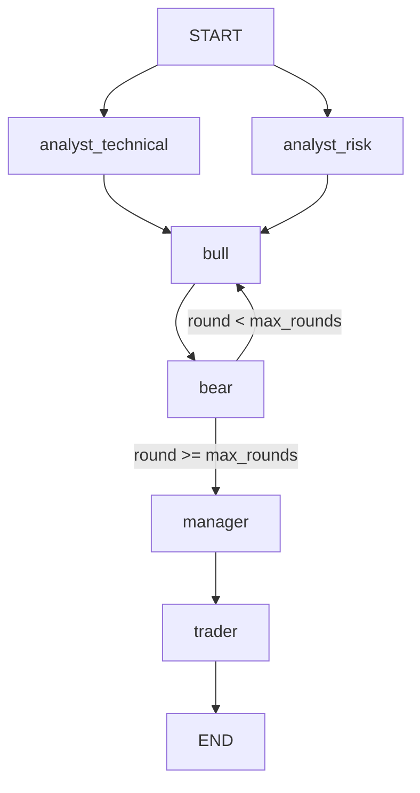

# Roundtable

A multi-agent stock trading analysis system that evaluates market data through parallel analysts, a bull/bear debate, and a structured trader decision.

## Overview

Roundtable orchestrates specialized LLM agents using LangGraph to analyze stock tickers and produce actionable trading decisions. Technical and risk analysts process real-time market data, feed a multi-round bull/bear researcher debate, and hand off findings to a research manager who synthesizes a verdict for the final trader decision.

## Architecture

1. **Parallel Analysis**: Technical and risk analyst nodes fetch market data and evaluate trend and volatility metrics simultaneously.
2. **Debate Loop**: Bull and bear researcher nodes argue opposing investment theses over a configurable number of rounds.
3. **Synthesis & Decision**: A research manager evaluates the debate transcript to output a winning stance, which the trader node converts into a structured `BUY`, `HOLD`, or `SELL` decision.



## Requirements

- Python 3.10+
- Dependencies: `langgraph`, `google-genai`, `yfinance`, `pydantic`, `python-dotenv`
- Environment variable: `GEMINI_API_KEY` (read from `.env`)

## Installation

```bash
git clone https://github.com/user/roundtable.git
cd roundtable
python3 -m venv .venv
source .venv/bin/activate
pip install -r requirements.txt
cp .env.example .env
```

Add your API key to `.env`:

```env
GEMINI_API_KEY=your_gemini_api_key_here
```

## Usage

```bash
python cli.py TICKER [OPTIONS]
```

### Options

- `TICKER`: Target stock symbol (positional, required). Supports international tickers with exchange suffixes.
- `--rounds INT`: Number of bull/bear debate rounds (default: `2`).
- `--verbose`: Print the full debate transcript alongside the final decision.

### Examples

Run a standard analysis on Apple (`AAPL`):
```bash
python cli.py AAPL
```

Run a 3-round debate analysis on Petrobras (`PETR4.SA`):
```bash
python cli.py PETR4.SA --rounds 3
```

Run an analysis with the full debate transcript displayed:
```bash
python cli.py NVDA --verbose
```

## Configuration

- **Model Selection**: Configured in `llm.py` (`gemini-3.5-flash-lite`).
- **Debate Rounds**: Configurable at runtime via `--rounds` or defaulted in `cli.py`.

## Project Structure

```text
config.py     # Environment configuration and key loading
schemas.py    # Pydantic output schemas and LangGraph state dictionary
llm.py        # Gemini LLM API client wrapper with retry logic
data.py       # Market data retrieval and formatting via Yahoo Finance
agents.py     # Pure agent prompt logic and LangGraph node adapters
graph.py      # LangGraph workflow construction and compiled graph singleton
cli.py        # Command-line interface and execution entry point
```

## License

MIT License.
